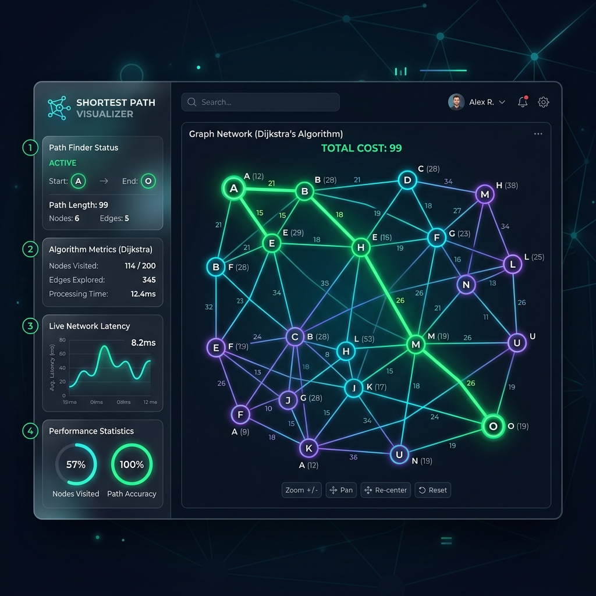

# ⚡ Shortest Path Visualizer

<div align="center">

[](https://reactjs.org/)
[](https://www.typescriptlang.org/)
[](https://vitejs.dev/)
[](https://tailwindcss.com/)
[](https://opensource.org/licenses/MIT)

An interactive, high-fidelity **Graph Theory Sandbox** built to visualize, trace, and compare **Dijkstra's Algorithm** and the **Bellman–Ford Algorithm** for finding the shortest path in weighted graphs.

[Explore Codebase](https://github.com/Hirishi24/daa_project) • [Report Bug](https://github.com/Hirishi24/daa_project/issues) • [Request Feature](https://github.com/Hirishi24/daa_project/issues)

</div>

---

## 📸 Interface Preview

<div align="center">
  
</div>

---

## ✨ Features

- 🎨 **Modern Glassmorphic UI**: Beautiful, premium dark-mode dashboard tailored with harmonious neon gradients, glass effects, and micro-animations.
- 🖱️ **Interactive SVG Graph Sandbox**:
  - Click on the canvas grid to immediately spawn nodes (labeled A, B, C...).
  - Drag-and-drop nodes to arrange and layout your graph organically.
  - Hold `Ctrl` (or `Shift`) and drag between nodes to connect them with weighted edges.
  - Double-click on any edge weight bubble to edit the weight inline.
  - Delete selected nodes or edges by pressing `Backspace` or `Delete`.
- ⚙️ **Robust Algorithm Engines**:
  - **Dijkstra's Algorithm**: Powered by a custom min-heap Priority Queue. Detects and issues warnings for negative edge weights.
  - **Bellman–Ford Algorithm**: Relaxes edges iteratively ($V-1$ iterations) with early convergence optimizations and **negative-weight cycle detection**.
- 🔊 **Synthesized Audio Feedback**: Built-in Web Audio API tone generator playing chimes, blips, success success-jingles, and error warning sirens matching algorithm steps.
- 📖 **Interactive Pseudocode Tracer**: Watch live pseudocode highlighting, step-by-step mathematical calculations, and distance tables synchronized with the execution steps.
- ⚖️ **Side-by-Side Comparison Mode**:
  - Runs both Dijkstra and Bellman–Ford simultaneously on your graph.
  - Evaluates performance metrics including duration (ms), total operations/checks, memory footprint estimation, and paths.
  - Awards a performance **Winner Badge** to the faster algorithm.
- 💾 **State Import & Exporters**:
  - **JSON Importer/Exporter**: Save and load custom graph layouts easily.
  - **PNG Capture**: Export high-resolution snapshots of your graph canvas.
  - **PDF Executive Report**: Generate formal PDF documents outlining execution steps, comparative analysis charts, and result matrices.

---

## 📂 Codebase Directory Structure

```text
elegant-tesla/
├── public/                  # Favicons, vector SVGs and assets
├── src/
│   ├── assets/              # Interface screenshots and static media
│   ├── components/
│   │   ├── ComparisonDashboard.tsx  # Side-by-side execution analysis
│   │   ├── ControlPanel.tsx         # Sidebar controls, presets & exporters
│   │   ├── EducationalPanel.tsx     # Live pseudocode tracer & explanations
│   │   ├── GraphCanvas.tsx          # SVG sandbox canvas and node handlers
│   │   └── StatsBanner.tsx          # Top-bar summary stats
│   ├── types/
│   │   └── graph.ts                 # TS Definitions for Nodes, Edges, and Metrics
│   ├── utils/
│   │   ├── audio.ts                 # Web Audio API retro oscillator chimes
│   │   ├── bellmanFord.ts           # Bellman-Ford step compiler
│   │   ├── dijkstra.ts              # Min-heap based Dijkstra compiler
│   │   └── exporters.ts             # JSON, PNG, and jsPDF export handlers
│   ├── App.tsx              # Main dashboard organizer and shortcut listener
│   ├── index.css            # Tailwind v4 directives and grid background
│   └── main.tsx             # React SPA entry point
├── package.json             # NPM metadata and dependencies
├── tsconfig.json            # Strict TypeScript configuration
└── vite.config.ts           # Bundler and Tailwind compilation config
```

---

## ⌨️ Keyboard Shortcuts

| Shortcut | Action |
| :--- | :--- |
| <kbd>Space</kbd> | Play / Pause visualization playback |
| <kbd>→</kbd> | Step Forward one iteration |
| <kbd>←</kbd> | Step Backward one iteration |
| <kbd>R</kbd> | Reset the visualizer to the beginning |
| <kbd>C</kbd> | Clear the canvas grid completely |
| <kbd>Backspace</kbd> / <kbd>Delete</kbd> | Delete selected node or edge |

---

## 🚀 Getting Started

To run the project locally on your machine, follow these simple setup steps:

### Prerequisites

Make sure you have Node.js (v18 or higher) and npm installed.

### Installation

1. Clone the repository:
   ```bash
   git clone https://github.com/Hirishi24/daa_project.git
   cd daa_project
   ```

2. Install dependencies:
   ```bash
   npm install
   ```

3. Spin up the local development server:
   ```bash
   npm run dev
   ```

4. Open your browser and navigate to `http://localhost:5173`.

### Production Build

To build the project for production, run:
```bash
npm run build
```
This generates optimized HTML, JS, and CSS static files inside the `dist/` directory, ready to be hosted on Vercel, Netlify, or GitHub Pages.

---

## 🎓 Algorithms Reference

### Dijkstra's Algorithm
Dijkstra's algorithm finds the shortest path from a source node to all other nodes in a graph with non-negative edge weights.
- **Time Complexity**: $\mathcal{O}((V + E) \log V)$ using our Min-Heap Priority Queue.
- **Limitation**: Fails to compute correct paths or loops infinitely on graphs containing negative weights.

### Bellman-Ford Algorithm
Bellman-Ford computes shortest paths from a single source vertex to all other vertices. It is slower than Dijkstra but handles negative weights and detects negative cycles.
- **Time Complexity**: $\mathcal{O}(V \cdot E)$
- **Cycle Detection**: If an edge can be relaxed after $V-1$ iterations, a negative-weight cycle exists.

---

## 🏆 Project Credits

This project was developed for the Design and Analysis of Algorithms (DAA) study:

- **Harsha devi**
- **Kevin**

Licensed under the [MIT License](LICENSE).
